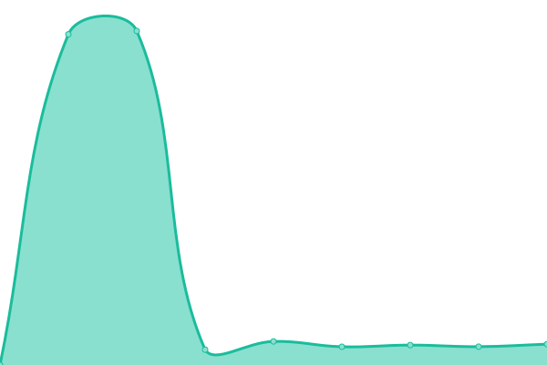

# 

 

Deze repository houdt automatisch de online status en prestaties van de websites, servers en diensten onder www.stryv.nl bij.  
Met behulp van [Upptime](https://upptime.js.org) worden alle uptime-metingen, responstijden en incidentmeldingen volledig open source vastgelegd en weergegeven op onze publieke statuspagina.

De metingen worden elke paar minuten uitgevoerd via GitHub Actions en de resultaten zijn publiek inzichtelijk — transparant, betrouwbaar en privacy-vriendelijk.

 

## [📈 Live Status](https://stryv-nl.github.io/upptime-stryv): <!--live status--> **🟢 Geen incidenten**

 

 

<!--start: status pages-->
<!-- This summary is generated by Upptime (https://github.com/upptime/upptime) -->
<!-- Do not edit this manually, your changes will be overwritten -->
<!-- prettier-ignore -->
| URL | Status | Geschiedenis | Responstijd | Totale uptime |
| --- | ------ | ------- | ------------- | ------ |
|  [stryv.nl](www.stryv.nl) | 🟢 Online | [stryv-nl.yml](https://github.com/stryv-nl/upptime-stryv/commits/HEAD/history/stryv-nl.yml) | 

 16ms
     
 | 

<a href="https://stryv-nl.github.io/upptime-stryv/history/stryv-nl">100.00%</a>
    

|  [LiteSpeed Server](www.stryv.nl/health-litespeed.php) | 🟢 Online | [lite-speed-server.yml](https://github.com/stryv-nl/upptime-stryv/commits/HEAD/history/lite-speed-server.yml) | 

 297ms
     
 | 

<a href="https://stryv-nl.github.io/upptime-stryv/history/lite-speed-server">100.00%</a>
    

|  [IMAP Server](imap.fastmail.com) | 🟢 Online | [imap-server.yml](https://github.com/stryv-nl/upptime-stryv/commits/HEAD/history/imap-server.yml) | 

 84ms
     
 | 

<a href="https://stryv-nl.github.io/upptime-stryv/history/imap-server">100.00%</a>
    

|  [SMTP Server](smtp.fastmail.com) | 🟢 Online | [smtp-server.yml](https://github.com/stryv-nl/upptime-stryv/commits/HEAD/history/smtp-server.yml) | 

 83ms
     
 | 

<a href="https://stryv-nl.github.io/upptime-stryv/history/smtp-server">100.00%</a>
    

<!--end: status pages-->

 

## 💬 Contact & Support

 

Heb je vragen over deze statuspagina of ondervind je problemen met één van onze diensten?  
Ons team helpt je graag verder.

📧 **E-mail:** [happier@stryv.nl](mailto:happier@stryv.nl)  
🟩 **WhatsApp:** [0495 – 234 444](https://wa.me/31495234444)  
📞 **Telefoon:** 0495 – 234 444

 

## 📄 Licentie

- De broncode van dit project valt onder de [MIT-licentie](./LICENSE) © [Anand Chowdhary](https://anandchowdhary.com),  
  met ondersteuning van [Pabio](https://pabio.com).
- De gegevens in de map [`./history`](./history) zijn beschikbaar onder de  
  [Open Database License (ODbL)](https://opendatacommons.org/licenses/odbl/1-0/).
